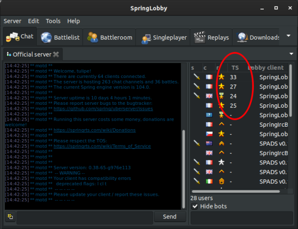

# Springlobby0.268-alternative

springlobby 0.268 with some fixes and some changes.

# Changes compared to 0.268

## Battlerrom tab : 

* contextual menu fixed: so in tchat bar you don't have to write "!ring playername" necessarily. Just right click on a player name and then click on ring.
  &nbsp;  
        
  &nbsp;  

* better behavior with cases to tick.
  

  Auto-launch game case not auto ticked when you go spectator. So game not autolaunch.

  
  &nbsp;  
  &nbsp;  

* 4 new buttons : status, balance, fixcolors, ring.
  
  &nbsp;  
  (before:
  
  )
  &nbsp;  
  &nbsp;  

* Fixed the disappearance of some buttons if you changed the size of the window with battleroomtab activated. Sometime the start button was disappearing. Now it should be solved by placing buttons on 2 lines. (Tested. Worked for windows. Not for linux.)
&nbsp;  

&nbsp;  
&nbsp;  

### Select map window : now background is black, instead grey. Could less hurt eyes.

| before                                                                          | after                                                                            |
| ------------------------------------------------------------------------------- | -------------------------------------------------------------------------------- |
|  |  |
&nbsp;    

## Chat tab : new column with TS displayed (after you joined battleroom tab at least one time): so you can have ts of all players now visible here.
&nbsp;  
       

&nbsp;  

## Battlelist tab : new column with TS displayed (after you joined battleroom at least one time)

&nbsp;  
&nbsp;  

## Message : "You are already in a battle..." removed.

&nbsp;  
***

## Problems present in 0.268 and still exist with 0.268-alternative :

- After the map is changed from selectmap window the map name visible in battleroom tab is not changed.

- Country flags are not displayed when mouse is over a player name (unsure if this situation is generalized or it's just for me).
- Parameters are displayed two times instead only one, in select map window.

| Parameters displayed two times in select map window. |  |
| ---------------------------------------------------- | ------------------------------------------------------------ |
|                                                      |                                                              |
- Maps are not sorted correctly after you selected one item. It's needed to click on sign "<" or ">". 
&nbsp;  
&nbsp;  

## Features to consider:
- Auto launch a replay if double click on a line of the replays list (it is when you are in replays tab).
- Display geos positions on the map

| Actually geos positions are not displayed on map |  |
| :----------------------------------------------: | ------------------------------------------------------------ |
|                                                  |                                                              |

&nbsp;  
&nbsp;  
&nbsp;  

# Readme from springlobby original (https://github.com/springlobby/springlobby)
all installation information can be found here:
https://github.com/springlobby/springlobby/wiki/Install

for compiling from source see:
https://github.com/springlobby/springlobby/wiki/InstallFromSource

#License

SpringLobby is released under GPL v2 (or later):

This program is free software; you can redistribute it and/or modify
it under the terms of the GNU General Public License as published by
the Free Software Foundation; either version 2 of the License, or
(at your option) any later version.

This program is distributed in the hope that it will be useful,
but WITHOUT ANY WARRANTY; without even the implied warranty of
MERCHANTABILITY or FITNESS FOR A PARTICULAR PURPOSE.  See the
GNU General Public License for more details.

You should have received a copy of the GNU General Public License along
with this program; if not, write to the Free Software Foundation, Inc.,
51 Franklin Street, Fifth Floor, Boston, MA 02110-1301 USA.

